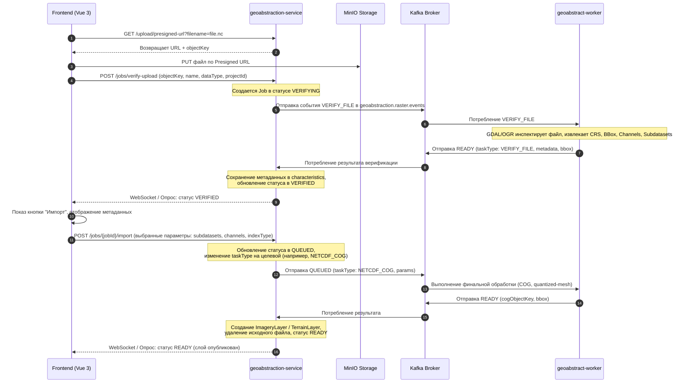

# Стратегия перехода на двухэтапную загрузку и импорт файлов геоданных

## 1. Цели и задачи
Текущий процесс импорта тяжелых файлов (GeoTIFF, Sentinel-2, Landsat-8, Terrain DEM) выполняется «вслепую»: файл сразу загружается на S3, и для него запускается обработка. Это не позволяет:
1. Выполнить предварительную проверку целостности файла с помощью GDAL/OGR до начала ресурсоемкой обработки.
2. Показать пользователю извлеченные метаданные (разрешение, CRS, охват BBox, количество каналов, список переменных/субдатасетов).
3. Позволить пользователю выбрать специфические параметры импорта на основе метаданных (например, выбрать конкретные переменные/Subdatasets в файлах **NetCDF**, указать режим рендеринга или перепроецирование).

**Новое решение** разделяет процесс на два этапа:
* **Этап 1: Загрузка и верификация:** Файл заливается по Presigned URL на S3, после чего воркер автоматически проверяет его с помощью GDAL, парсит метаданные и переводит задачу в статус `VERIFIED`.
* **Этап 2: Параметризация и запуск импорта:** Пользователь видит результат верификации, открывает форму импорта, где на основе извлеченных метаданных настраивает параметры (каналы, пресеты, переменные NetCDF) и запускает финальный импорт.

---

## 2. Схема взаимодействия (Sequence Diagram)

---

## 3. Необходимые изменения в коде

### 3.1. Изменения в `geoabstraction-service` (Java)

1. **[GeoAbstractJobStatus](file:///C:/Users/admin/Documents/dev/geoinfo-system/geoabstraction-service/src/main/java/kg/geoinfo/system/geoabstraction/models/enums/GeoAbstractJobStatus.java):**
   * Добавить статусы `VERIFYING` и `VERIFIED` в перечисление (enum).

2. **[GeoAbstractionController](file:///C:/Users/admin/Documents/dev/geoinfo-system/geoabstraction-service/src/main/java/kg/geoinfo/system/geoabstraction/controller/GeoAbstractionController.java):**
   * Создать эндпоинт `POST /api/geo-abstraction/jobs/verify-upload` для инициации верификации:
     * Принимает: `name`, `objectKey`, `fileSize`, `dataType` (строка/enum: `GEOTIFF`, `SENTINEL_2`, `LANDSAT_8`, `TERRAIN`, `NETCDF`), `projectId`.
     * Создает `GeoAbstractJob` со статусом `VERIFYING` и типом задачи `VERIFY_FILE`. Сохраняет `dataType` в характеристиках (`characteristics.dataType`).
     * Отправляет в Kafka событие `VERIFY_FILE`.
   * Создать эндпоинт `POST /api/geo-abstraction/jobs/{id}/import` для запуска импорта:
     * Принимает: `jobId` пути, JSON с параметрами (пресет, каналы, переменные NetCDF).
     * Проверяет, что статус равен `VERIFIED`.
     * Меняет статус на `QUEUED`, а тип задачи — на соответствующий импорт (например, `RAW_GEOTIFF_OPTIMIZE`, `SENTINEL_COG`, `LANDSAT_COG`, `TERRAIN_MESH`, `NETCDF_COG`).
     * Записывает параметры в `characteristics`.
     * Отправляет в Kafka событие `QUEUED` с выбранными параметрами.

3. **[GeoAbstractionServiceImpl](file:///C:/Users/admin/Documents/dev/geoinfo-system/geoabstraction-service/src/main/java/kg/geoinfo/system/geoabstraction/service/GeoAbstractionServiceImpl.java):**
   * Добавить логику для новых эндпоинтов.
   * Дополнить метод `updateJobStatus`:
     * Если получен результат по задаче `VERIFY_FILE` со статусом `READY`:
       * Обновить статус задачи на `VERIFIED`.
       * Сохранить извлеченные метаданные (переданные в `characteristics.metadata`) в БД.
       * Сохранить полученный `bbox`.
     * Если получен результат `FAILED` для задачи `VERIFY_FILE`:
       * Перевести задачу в статус `FAILED` с сохранением сообщения об ошибке верификации.

4. **[KafkaConsumerService](file:///C:/Users/admin/Documents/dev/geoinfo-system/geoabstraction-service/src/main/java/kg/geoinfo/system/geoabstraction/service/kafka/KafkaConsumerService.java):**
   * Убедиться, что события от воркера по задаче `VERIFY_FILE` корректно передаются в метод `updateJobStatus`.

---

### 3.2. Изменения в `geoabstract-worker` (Python)

1. **[factory.py](file:///C:/Users/admin/Documents/dev/geoinfo-system/geoabstract-worker/app/processors/factory.py):**
   * Добавить маппинг типа задачи `"VERIFY_FILE"` на новый процессор `VerifierProcessor`.

2. **Создание `VerifierProcessor` (`app/processors/verifier.py`):**
   * Должен наследоваться от [BaseProcessor](file:///C:/Users/admin/Documents/dev/geoinfo-system/geoabstract-worker/app/processors/base.py).
   * Метод `process` делает следующее:
     1. Скачивает файл по `sourceObjectKey` во временную папку.
     2. Определяет тип файла по переданному `dataType`.
     3. Запускает проверку GDAL/OGR:
        * **Для GeoTIFF / Terrain:** Открывает через `gdal.Open` / `rasterio`. Извлекает: `crs`, `bbox` (WGS-84), размеры пикселей (высота, ширина), тип данных (`Float32`, `Byte` и т.д.), количество каналов.
        * **Для NetCDF:** Открывает файл, извлекает список доступных субдатасетов (Subdatasets) и переменных, их размеры и метаданные.
        * **Для Sentinel-2 / Landsat-8:** Распаковывает архив, проверяет наличие необходимых каналов спектральных метаданных, составляет список обнаруженных каналов.
     4. Если всё успешно, отправляет статус `READY` с типом задачи `VERIFY_FILE`, передавая словарь `metadata` и полигон `bbox` обратно в Kafka.
     5. При ошибке (файл поврежден, не распознан GDAL) — отправляет статус `FAILED`.

---

### 3.3. Изменения во `frontend` (Vue 3 / Vuetify)

1. **[ProcessJobsManager.vue](file:///C:/Users/admin/Documents/dev/geoinfo-system/frontend/src/components/geo-abstraction/ProcessJobsManager.vue):**
   * Выпадающий список «Создать задачу» расширяется и содержит все типы импортируемых данных:
     * *Снимки Sentinel-2*
     * *Снимки Landsat-8*
     * *Файл GeoTIFF*
     * *3D Рельеф (Terrain DEM)*
     * *Данные NetCDF*
   * Все пункты меню открывают **один общий диалог загрузки** `GeodataUploadDialog.vue`, передавая выбранный `dataType` в качестве входного параметра (prop).
   * В таблице задач для строк со статусом `VERIFIED` отображается кнопка «Импортировать».
   * При нажатии на «Импортировать» открывается специализированный диалог ввода параметров в зависимости от типа данных задачи (`dataType`).

2. **Создание единого диалога загрузки `GeodataUploadDialog.vue`:**
   * Заменяет собой устаревшие `SatelliteImageryUploadDialog.vue` и `TerrainUploadDialog.vue`.
   * Принимает `dataType` как prop и подстраивает интерфейс:
     * Меняет заголовок и подсказки (например: *«Загрузка данных NetCDF (.nc)»* или *«Загрузка GeoTIFF (.tif)»*).
     * Валидирует расширение файла при выборе (например, `.zip` для Sentinel/Landsat, `.nc` для NetCDF, `.tif/.tiff` для GeoTIFF).
   * Выполняет загрузку по Presigned URL напрямую на S3.
   * После загрузки вызывает метод `verifyUpload` из сервиса и закрывает окно, возвращая пользователя к списку задач, где задача отобразится в статусе `VERIFYING`.

3. **Разделение диалогов параметризованного импорта:**
   * Вместо единого громоздкого `ImportParametersDialog.vue` создается набор легковесных специализированных компонентов диалогов для каждого типа импорта:
     * **`SentinelImportDialog.vue`:** Отображает список найденных каналов, позволяет выбрать пресет (например, Natural Color) или вручную сопоставить каналы, а также указать индекс вегетации (NDVI, NDWI и др.).
     * **`LandsatImportDialog.vue`:** Аналогично Sentinel-2, но адаптировано под каналы и индексы Landsat 8.
     * **`GeoTiffImportDialog.vue`:** Позволяет выбрать режим отображения (Web RGB или аналитический), настроить значения NoData и диапазон масштабирования значений.
     * **`TerrainImportDialog.vue`:** Отображает высоту, CRS и предлагает настроить разрешение сетки/оптимизацию перед нарезкой рельефа.
     * **`NetcdfImportDialog.vue`:** Отображает список переменных (Variables/Subdatasets) из файла, позволяет выбрать одну или несколько переменных для экспорта в растровые слои, а также временной шаг (если применимо).
   * Каждый диалог после отправки формы вызывает `startImport(jobId, selectedParams)`, переводя задачу в статус `QUEUED` для непосредственной обработки в воркере.

4. **[geo-abstraction.service.ts](file:///C:/Users/admin/Documents/dev/geoinfo-system/frontend/src/services/geo-abstraction.service.ts):**
   * Добавить метод `verifyUpload(name, objectKey, fileSize, dataType, projectId)` для вызова `POST /api/geo-abstraction/jobs/verify-upload`.
   * Добавить метод `startImport(jobId, params)` для вызова `POST /api/geo-abstraction/jobs/${jobId}/import`.

---

## 5. План реализации

### Шаг 1: Доработка модели и API бэкенда
1. Обновить enum [GeoAbstractJobStatus](file:///C:/Users/admin/Documents/dev/geoinfo-system/geoabstraction-service/src/main/java/kg/geoinfo/system/geoabstraction/models/enums/GeoAbstractJobStatus.java).
2. Реализовать эндпоинты `verify-upload` и `{id}/import` в [GeoAbstractionController](file:///C:/Users/admin/Documents/dev/geoinfo-system/geoabstraction-service/src/main/java/kg/geoinfo/system/geoabstraction/controller/GeoAbstractionController.java) и [GeoAbstractionServiceImpl](file:///C:/Users/admin/Documents/dev/geoinfo-system/geoabstraction-service/src/main/java/kg/geoinfo/system/geoabstraction/service/GeoAbstractionServiceImpl.java).
3. Доработать обработку входящих сообщений в [KafkaConsumerService](file:///C:/Users/admin/Documents/dev/geoinfo-system/geoabstraction-service/src/main/java/kg/geoinfo/system/geoabstraction/service/kafka/KafkaConsumerService.java) для сохранения извлеченных метаданных в JSONB-поле `characteristics`.

### Шаг 2: Реализация верификатора на Python
1. Написать `VerifierProcessor` в `geoabstract-worker` с поддержкой GDAL/OGR инспектирования файлов.
2. Интегрировать `VerifierProcessor` в [factory.py](file:///C:/Users/admin/Documents/dev/geoinfo-system/geoabstract-worker/app/processors/factory.py).

### Шаг 3: Доработка UI
1. Обновить выпадающий список в [ProcessJobsManager.vue](file:///C:/Users/admin/Documents/dev/geoinfo-system/frontend/src/components/geo-abstraction/ProcessJobsManager.vue) и привязать к новой логике вызова `GeodataUploadDialog.vue`.
2. Создать единый [GeodataUploadDialog.vue](file:///C:/Users/admin/Documents/dev/geoinfo-system/frontend/src/components/geo-abstraction/GeodataUploadDialog.vue).
3. Создать специализированные диалоги импорта (`SentinelImportDialog.vue`, `NetcdfImportDialog.vue` и др.) и интегрировать их вызов по нажатию на кнопку «Импортировать» в таблице задач.
