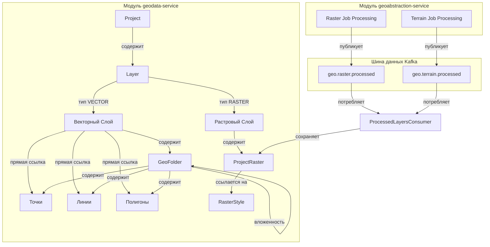

# Отчет о рефакторинге структуры слоев и интеграции растров

## Введение
Данный документ подробно описывает выполненные изменения в рамках задачи рефакторинга иерархии геоданных. Целью рефакторинга было внедрение сущности **Слой (Layer)** в качестве корневого элемента проекта, перенос метаданных растровых слоев из `geoabstraction-service` в `geodata-service`, организация иерархии папок под слоями, а также унификация интерфейса импорта растровых данных и рельефа.

---

## Архитектура системы после рефакторинга

---

## Детали изменений

### 1. База данных и Ликвидация зависимостей в `geodata-service`
*   Создан новый лог миграций Liquibase: `release-1.3.0/release.changelog.yaml` и соответствующий SQL-скрипт `add_layers_and_rasters.sql`.
*   Созданы новые таблицы в БД:
    *   `geodata.layers` — содержит `id`, `project_id`, `name`, `description`, `type` (VECTOR/RASTER) и `characteristics`.
    *   `geodata.project_rasters` — содержит метаданные обработанных растровых слоев (включая рельеф), привязанных к конкретным слоям (`layer_id`).
    *   `geodata.raster_layers` — содержит общедоступные глобальные растровые подложки.
    *   `geodata.raster_styles` — содержит кастомные и системные цветовые шкалы для растровых данных.
*   Обновлены связи существующих таблиц:
    *   Таблица `geodata.folders` теперь ссылается на `layer_id` вместо `project_id`. Настроен каскадный делейт.
    *   В таблицы `project_points`, `project_multilines` и `project_polygons` добавлен столбец `layer_id` для поддержки объектов без папки непосредственно в корне слоя.

### 2. Изменения в коде Backend (`geodata-service` и `geoabstraction-service`)
*   **Сущности и DTO**:
    *   Создана сущность `Layer` (`LayerType` enum: `VECTOR`, `RASTER`).
    *   Созданы сущности `ProjectRaster` (проектные растры/DEM) и `RasterLayer` (глобальные подложки).
    *   Создана сущность `RasterStyle` (перенесена из `geoabstraction-service`).
*   **Полное удаление `ImageryLayer` и `RasterStyle` из `geoabstraction-service`**:
    *   Удалены все legacy файлы (контроллеры, репозитории, DTO, сервисы, сущности).
    *   Сервисы `AnalysisTaskServiceImpl.java` и `GeoAbstractionServiceImpl.java` больше не сохраняют метаданные в локальную базу данных, а напрямую передают payload по Kafka.
    *   Связывание с COG-ключами на этапе выполнения расчетов осуществляется через Feign-клиент `GeoDataServiceClient.java` путем прямого запроса к `geodata-service`.
*   **Автоматическое связывание при импорте и создании**:
    *   `KmlImportServiceImpl` автоматически создает векторный слой для проекта при импорте KML и привязывает всю иерархию папок и геометрий к нему.
    *   Методы `create` в сервисах `ProjectPointServiceImpl`, `ProjectMultilineServiceImpl` и `ProjectPolygonServiceImpl` автоматически резолвят векторный слой. Если геометрия создается на корневом уровне (без папки), она привязывается к первому попавшемуся или вновь созданному векторному слою проекта.
*   **Kafka-интеграция**:
    *   Разработан класс `ProcessedLayersConsumer.java` для прослушивания топиков `geo.raster.processed` и `geo.terrain.processed`.
    *   При поступлении событий консьюмер автоматически создает или находит растровый слой проекта, сохраняя метаданные (включая признак `isTerrain` и URL в `characteristics`) в таблицу `project_rasters`.
*   **REST API**:
    *   Создан `LayerController` для CRUD-операций над слоями.
    *   Создан `ProjectRasterController` для управления проектными растрами.
    *   Создан `RasterLayerController` для глобальных растровых подложек.
    *   Создан `RasterStyleController` для управления цветовыми шкалами.

### 3. Изменения в коде Frontend (`frontend`)
*   **TypeScript типы и API Клиент**:
    *   В `types/api.ts` добавлены интерфейсы `Layer`, `ProjectRaster`, `RasterStyle` и `RasterLayer`.
    *   В `services/geodata.service.ts` добавлены REST API методы для работы со слоями и растрами.
    *   В `services/raster-style.service.ts` изменен базовый адрес на `/geodata/raster-style`.
*   **Vuex Хранилище (`geodata.store.ts`)**:
    *   Переписан механизм `fetchImageryLayers` и `fetchTerrainLayers`. Теперь они запрашивают слои и растры проекта напрямую из `geodata-service`.
    *   Успешно реализована обратная совместимость: растры без признака рельефа маппятся в стейт `imageryLayers`, а с признаком `isTerrain: true` (рельеф) — в стейт `terrainLayers`.
    *   Добавлены глобальные состояния `visibleRasterIds` и `rasterOpacities` для реактивной синхронизации видимости и прозрачности между интерактивной картой и TOC деревом слоев.
*   **Интерактивное TOC дерево слоев (`GeoObjectTree.vue` / `FolderItem.vue`)**:
    *   Растровые слои теперь отображаются в общем дереве объектов.
    *   Добавлен интерактивный вид для растровых элементов дерева:
        1.  **Toggle видимости** (через иконку глаза, реактивно обновляет карту Cesium и OpenLayers).
        2.  **Слайдер прозрачности** (inline-ползунок 0-100%, плавно меняет прозрачность слоя на карте в реальном времени через watcher без перезагрузки тайлов).
        3.  **Смена стиля** (dropdown со списком всех встроенных шкал TiTiler и кастомных стилей из редактора).
        4.  **Кнопка редактора стилей** (интегрирована с `RasterStyleEditorDialog.vue`, позволяет создавать новые и изменять существующие цветовые шкалы прямо из дерева).
*   **Интерфейс пользователя на карте**:
    *   Создан компонент `ProjectProcessJobsManager.vue` для отображения задач обработки и загрузки файлов.
    *   В `MapComponentMVT.vue` и `CesiumMapComponent.vue` удалены две старые кнопки на панели карты и добавлена одна кнопка **"Импортировать растровый слой"** (`mdi-database-import`), которая открывает `ProjectProcessJobsManager` в диалоговом окне.

---

## Проверка работоспособности
1.  **Сборка Backend**: Все сервисы успешно компилируются с помощью Maven. Ошибок компиляции или несовместимости типов в Java нет.
2.  **Сборка Frontend**: Проект успешно собирается с помощью Vite (`npm run build` завершается со статусом `exit 0` без ошибок компилятора).
