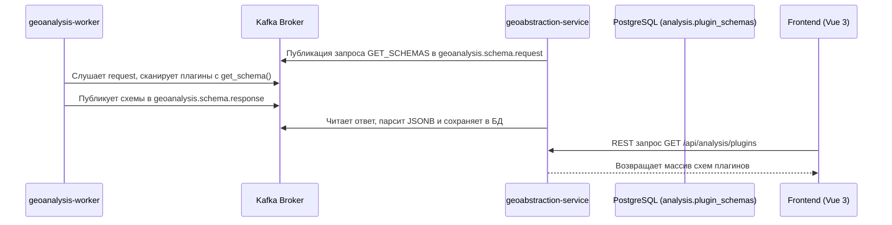

# 📋 Стратегия перехода к Schema-Driven UI для модулей геоаналитики (Реализовано)

Документ описывает реализованную архитектуру внедрения динамических форм для запуска плагинов геоанализа на базе декларативных JSON-схем.

---

## 📌 Текущий статус: РЕАЛИЗОВАНО (IMPLEMENTED)

Все этапы интеграции управляемого схемами интерфейса (Schema-Driven UI) успешно завершены. Воркер регистрирует схемы, бэкенд валидирует входящие параметры по JSON-схеме Draft-07, а фронтенд динамически строит формы запуска с интерактивными ГИС-виджетами.

---

## 1. Архитектурная модель обмена и хранения схем

### 1.1. Python воркер (`geoanalysis-worker`)
*   В базовом классе `GeoWorkerPlugin` в [base_plugin.py](file:///C:/Users/admin/Documents/dev/geoinfo-system/geoanalysis-worker/app/core/base_plugin.py) объявлен метод `get_schema() -> Optional[dict]`. По умолчанию он возвращает `None` (признак системного плагина).
*   Созданы 3 устанавливаемых несистемных плагина с интерактивными схемами:
    *   `viewshed_analysis_dynamic` (Зоны видимости по точке наблюдателя)
    *   `raster_reclass_dynamic` (Реклассификация по интервалам)
    *   `raster_algebra_dynamic` (Калькулятор растров с динамическим набором переменных)
*   Схемы описаны в отдельных `.schema.json` файлах плагинов и валидированы по спецификации **JSON Schema Draft-07**.

### 1.2. Бэкенд (`geoabstraction-service`)
*   **Инициализация:** При старте (`ApplicationReadyEvent`) в `PluginSchemaRegistrationService` бэкенд очищает таблицу `analysis.plugin_schemas` и отправляет запрос в Kafka.
*   **Хранение:** JPA-сущность `PluginSchema` сохраняет структуру схемы в поле `schema` типа JSONB (с использованием `@JdbcTypeCode(SqlTypes.JSON)`).
*   **Серверная валидация:** Внедрена библиотека `com.networknt:json-schema-validator`. При создании задачи в `AnalysisTaskServiceImpl.createTask()` параметры DTO автоматически валидируются по сохраненной JSON-схеме соответствующего плагина.
*   **REST эндпоинт:** Создан эндпоинт `GET /api/analysis/plugins` для раздачи зарегистрированных схем фронтенду.

### 1.3. Фронтенд (`frontend`)
*   **Интеграция с Vuex:** В `geodata.store.ts` реализован экшен `fetchPluginSchemas` для загрузки схем из бэкенда в реактивное состояние.
*   **Динамический рендеринг формы (`DynamicSchemaForm.vue`):** Рекурсивно парсит свойства JSON-схемы и генерирует элементы Vuetify. Специальные типы данных ГИС привязаны к кастомным виджетам:
    *   `"format": "map-point"` -> [MapPointPicker.vue](file:///C:/Users/admin/Documents/dev/geoinfo-system/frontend/src/components/map/shared/MapPointPicker.vue) (интерактивный выбор точки кликом на 2D/3D карте).
    *   `"format": "raster-layer"` / `"vector-layer"` / `"terrain-layer"` -> селекторы активных слоев проекта.
    *   `"format": "project-document"` -> [ProjectDocumentPicker.vue](file:///C:/Users/admin/Documents/dev/geoinfo-system/frontend/src/components/map/shared/ProjectDocumentPicker.vue) (выбор DXF или иных документов проекта).
    *   `"format": "vector-field-select"` -> [VectorFieldSelector.vue](file:///C:/Users/admin/Documents/dev/geoinfo-system/frontend/src/components/map/shared/VectorFieldSelector.vue) (выбор колонок атрибутов вектора).
    *   `"ui:widget": "reclass_rules"` -> [RulesMatrixEditor.vue](file:///C:/Users/admin/Documents/dev/geoinfo-system/frontend/src/components/map/shared/RulesMatrixEditor.vue) (динамическая матрица интервалов).
*   **Диалог запуска (`DynamicAnalysisDialog.vue`):** Контейнер формы, управляющий отображением и блокировкой запуска. Использует свойство `eager` для сохранения состояния виджетов и watcher-ов во время кликов выбора координат на карте.
*   **Интеграция с меню инструментов:** Меню [MapAnalysisMenu.vue](file:///C:/Users/admin/Documents/dev/geoinfo-system/frontend/src/components/map/controls/MapAnalysisMenu.vue) динамически запрашивает схемы из Vuex и автоматически отрисовывает новые устанавливаемые модули в разделе "Устанавливаемые модули (Динамические)".

---

## 2. Спецификация поддерживаемых ГИС-форматов JSON-схем

| Формат / Виджет | Тип данных | Отображаемый интерфейс |
| --- | --- | --- |
| `"format": "raster-layer"` | `string` | Селектор активных Imagery (растровых) слоев |
| `"format": "vector-layer"` | `string` | Селектор векторных слоев проекта |
| `"format": "terrain-layer"` | `string` | Селектор DEM-моделей рельефа |
| `"format": "map-point"` | `object` `{x, y}` | Поля координат с кнопкой интерактивного пика на карте |
| `"format": "project-document"` | `string` | Выпадающий список документов проекта с фильтром расширений |
| `"format": "vector-field-select"` | `string` | Выбор атрибутивной колонки выбранного векторного слоя |
| `"ui:widget": "reclass_rules"` | `array` | Таблица интервалов с добавлением/удалением строк |

---

## 3. Чек-лист по добавлению нового устанавливаемого модуля
Для добавления нового плагина с динамическим UI разработчику достаточно:
1. Создать файл плагина в `geoanalysis-worker/app/plugins/` унаследовав его от `GeoWorkerPlugin`.
2. Реализовать в нем метод `get_schema(self) -> Optional[dict]`, возвращающий JSON-схему.
3. Описать в `.schema.json` входы (`inputs`), параметры (`parameters`), валидационные правила и метаданные (заголовок, иконка mdi).
4. Перезапустить воркер и бэкенд — диалог запуска автоматически появится на интерактивной карте у всех пользователей без модификации кода фронтенда.
