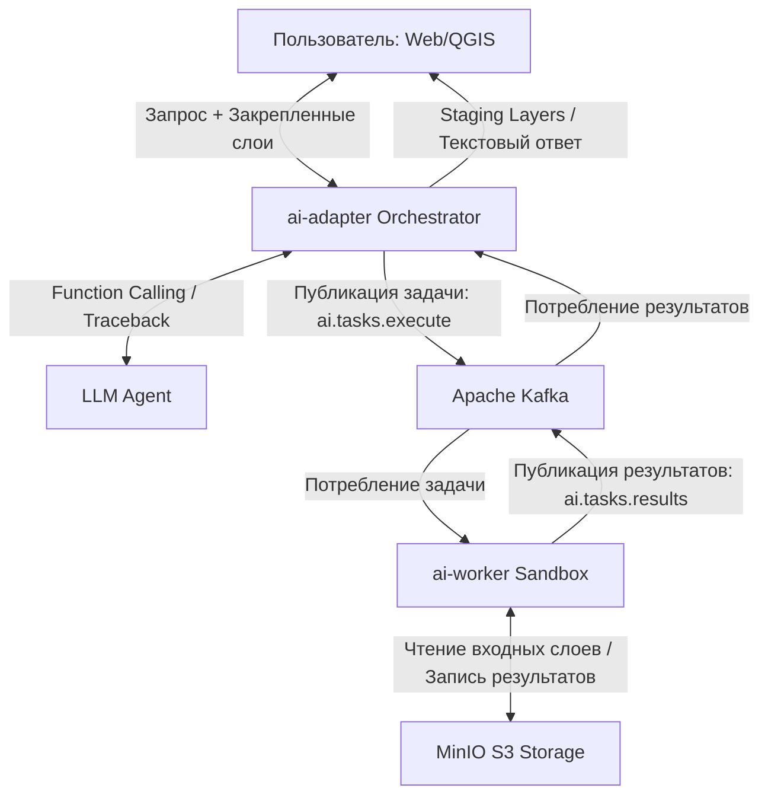

# Стратегия интеграции LLM-ассистента (AI Analytical Assistant) в Геоинформационную Систему

Данный документ описывает архитектурную стратегию и детальный системный проект внедрения автоматического геоаналитического помощника на базе LLM. Проект разработан для полной интеграции и совместимости со существующей кодовой базой микросервиса управления задачами `geoabstraction-service` и ГИС-воркера `geoanalysis-worker`.

---

## 1. Общая архитектура системы и интеграция

Интеграция спроектирована как надстройка над существующей событийной моделью ГИС-расчетов:

1. **Интерфейс пользователя (Frontend / QGIS-плагин)**: Панель чата с возможностью прикрепления (Prompt Anchoring) объектов проекта для контекста модели.
2. **Микросервис `ai-adapter` (Java / Spring Boot)**: Агентский оркестратор, использующий PostgreSQL для хранения истории сессий и задач, и Apache Kafka для координации с воркером.
3. **Изолированный воркер `ai-worker` (Python / Docker Sandbox)**: Служба выполнения динамического кода, наследующая стек и утилиты `geoanalysis-worker`, но запускающая скрипты в защищенной песочнице.
4. **LLM (Ядро)**: Интеллектуальный агент с поддержкой Function Calling.

### Схема взаимодействия (Event-Driven Agentic Workflow)



---

## 2. Управление контекстом: Prompt Anchoring

Для защиты от галлюцинаций LLM и минимизации размера контекста:
* Пользователь явно прикрепляет в чате объекты проекта (слои, папки, конкретные векторы/растры).
* `ai-adapter` запрашивает метаданные прикрепленных объектов из `geodata-service` (схема атрибутов, тип геометрии, проекция, границы BBox). Полные геометрические координаты (массивы точек) в контекст **не передаются**, что экономит 99% токенов.

---

## 3. Архитектура микросервиса `ai-adapter`

Сервис `ai-adapter` пишется на Java 17 + Spring Boot 3 и повторяет паттерны `geoabstraction-service`.

### Схема сущностей БД (JPA Entities)

Для поддержки цепочек вызовов (Task Chaining) и циклов автоисправления (Self-Correction Loop) база данных расширяется следующими сущностями (схема `analysis`):

```java
@Entity
@Table(name = "ai_sessions", schema = "analysis")
public class AiSession extends AuditableCustom<String> {
    @Id
    private UUID id;
    private UUID projectId;
    private UUID userId;
}

@Entity
@Table(name = "ai_messages", schema = "analysis")
public class AiMessage extends AuditableCustom<String> {
    @Id
    private UUID id;
    
    @ManyToOne(fetch = FetchType.LAZY)
    @JoinColumn(name = "session_id")
    private AiSession session;
    
    private String role; // 'user', 'assistant', 'system', 'tool'
    private String content;
    
    @JdbcTypeCode(SqlTypes.JSON)
    private Map<String, Object> toolCalls;
}

@Entity
@Table(name = "ai_tasks", schema = "analysis")
public class AiTask extends AuditableCustom<String> {
    @Id
    private UUID id;
    
    @ManyToOne(fetch = FetchType.LAZY)
    @JoinColumn(name = "session_id")
    private AiSession session;
    
    @Enumerated(EnumType.STRING)
    private AiTaskStatus status; // PENDING, PROCESSING, COMPLETED, FAILED, RETRYING
    
    private String generatedCode;
    private int retryCount;
    private int maxRetries;
    private String errorMessage;
    
    @JdbcTypeCode(SqlTypes.JSON)
    private Map<String, String> s3InputPaths; // Карты входных S3-путей
    
    @JdbcTypeCode(SqlTypes.JSON)
    private Map<String, String> s3OutputPaths; // Карты выходных S3-путей
}
```

### Формат сообщений в Kafka (Schemas)

* **Топик отправки задачи `ai.tasks.execute`**:
  ```json
  {
    "taskId": "c9a6479b-2b48-4cdb-86d7-2101df4c6b65",
    "scriptType": "PYTHON",
    "code": "import rasterio\n# ... сгенерированный LLM код ...",
    "inputs": {
      "input_dem": "s3://gis-data/raw/dem_2026.tif",
      "forest_mask": "s3://gis-data/temp/task_abc/forest.geojson"
    },
    "outputFiles": ["result.tif", "statistics.json"],
    "pipPackages": ["scipy", "networkx"]
  }
  ```

* **Топик возврата результата `ai.tasks.results`**:
  ```json
  {
    "taskId": "c9a6479b-2b48-4cdb-86d7-2101df4c6b65",
    "status": "COMPLETED", // или "FAILED"
    "outputs": {
      "result_raster": "s3://gis-data/temp/c9a6479b/result.tif",
      "stats_table": "s3://gis-data/temp/c9a6479b/statistics.json"
    },
    "error": null, // или Traceback в случае ошибки
    "executionTimeMs": 2345
  }
  ```

---

## 4. Архитектура воркера `ai-worker`

Воркер реализуется на Python и наследует структуру `geoanalysis-worker`.

### Контейнеризация и двухфазная песочница
Поскольку скрипты LLM могут содержать вредоносный код или критические ошибки, воркер изолирует их выполнение с использованием Docker API (без Podman).

```
                  ┌──────────────────────────────────────────────┐
                  │              ai-worker Manager               │
                  └──────────────────────┬───────────────────────┘
                                         │
                   1. Создает Workspace /tmp/task_<taskId>/
                                         │
                                         ▼
                  ┌──────────────────────────────────────────────┐
                  │       Фаза 1: Контейнер Подготовки (Prep)    │
                  │   (Сетевой доступ разрешен для pip install)  │
                  └──────────────────────┬───────────────────────┘
                                         │
                   2. Выполняет: pip install --target /workspace/libs <pipPackages>
                                         │
                                         ▼
                  ┌──────────────────────────────────────────────┐
                  │     Фаза 2: Контейнер Выполнения (Sandbox)   │
                  │        (Изоляция gVisor, --network none)     │
                  └──────────────────────┬───────────────────────┘
                                         │
                   3. Глобальные ГИС-настройки:
                      - Добавление /workspace/libs в PYTHONPATH
                      - GDAL CPL_TMPDIR = /workspace
                      - GDAL GDAL_CACHEMAX = 512
                   4. Запуск Python-скрипта с таймаутом 5 минут
                                         │
                                         ▼
                   5. Репроекция векторов в EPSG:4326 (gdal.VectorTranslate)
                   6. Выгрузка в MinIO: temp/{taskId}/{fileName}
                   7. Очистка директории /tmp/task_<taskId>/
```

### Репроекция векторных результатов
В соответствии с поведением `geoanalysis-worker`, все векторные результаты воркера перед выгрузкой в MinIO должны быть репроецированы в СК `EPSG:4326` (WGS 84). Для этого в `ai-worker` используется модуль GDAL:

```python
def ensure_vector_in_4326(local_path: str) -> str:
    from osgeo import ogr, osr, gdal
    try:
        ds = ogr.Open(local_path)
        if ds is None:
            return local_path
        layer = ds.GetLayer()
        srs = layer.GetSpatialRef()
        
        target_srs = osr.SpatialReference()
        target_srs.ImportFromEPSG(4326)
        
        if srs and not srs.IsSame(target_srs):
            ds = None # Закрываем для записи
            temp_path = local_path + ".4326"
            ext = os.path.splitext(local_path)[1].lower()
            driver_name = 'GeoJSON' if ext == '.geojson' else 'GPKG'
            
            gdal.VectorTranslate(temp_path, local_path, format=driver_name, dstSRS='EPSG:4326')
            if os.path.exists(temp_path):
                os.replace(temp_path, local_path)
    except Exception as e:
        logger.warning(f"Failed to reproject vector {local_path}: {e}")
    return local_path
```

---

## 5. Цикл самоисправления (Self-Correction Loop)

В случае сбоя выполнения скрипта, система пытается автоматически исправить код:

1. `ai-worker` перехватывает лог системной ошибки Python (Traceback) и отправляет событие со сбоем в `ai.tasks.results`.
2. `ai-adapter` инкрементирует `retryCount`. Если `retryCount < maxRetries`, статус переводится в `RETRYING`.
3. Оркестратор отправляет повторный запрос в LLM, прикрепляя к контексту лог падения: *"Твой предыдущий скрипт завершился с ошибкой: [Traceback]. Проанализируй её, исправь код и вызови execute_gis_task повторно."*
4. По завершении лимита попыток задача завершается со статусом `FAILED`.

---

## 6. Безопасность и Валидация

* **Статическая AST-валидация**: На стороне воркера на фазе подготовки выполняется разбор синтаксического дерева сгенерированного Python-кода с запретом импорта модулей `subprocess`, `os` (за исключением безопасных операций пути), `ctypes`, `socket`, `urllib` для предотвращения вызовов уровня ОС.
* **Изоляция сети**: На фазе выполнения сетевой стек контейнера полностью отключается (`--network none`).
* **Контроль памяти**: Лимит ОЗУ в 4 ГБ гарантирует, что бесконтрольное чтение растра не приведет к Out-Of-Memory падению хост-системы.
* **Подтверждение пользователя (Human-in-the-Loop)**: Запуск задач, требующих экспорта результатов из песочниц в постоянные слои проекта (`Commit`), требует ручной валидации пользователем через кнопку в UI.