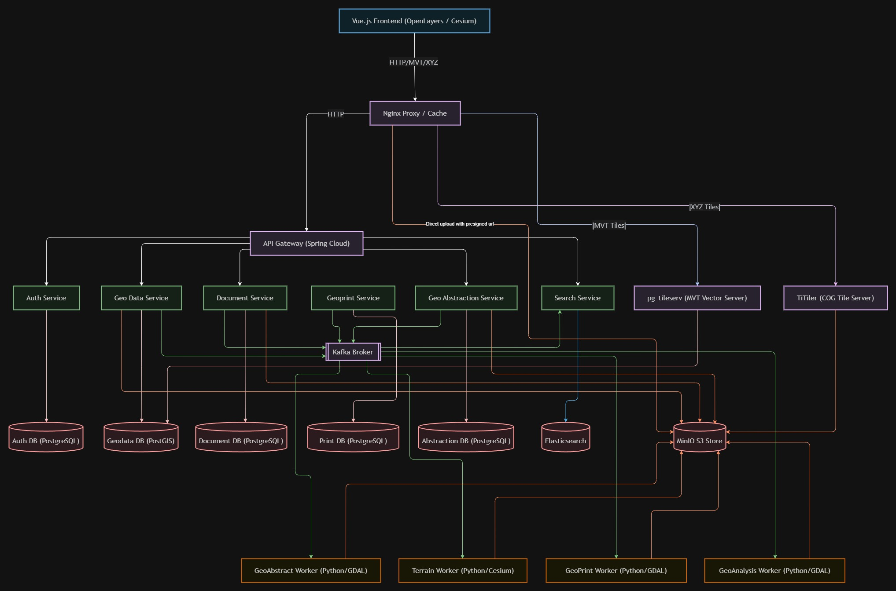

## **Финальное Архитектурное Описание Системы Интерактивной Карты**

### **1\. Общие Принципы и Архитектурная Модель**

Система построена на принципах **микросервисной архитектуры** с четким разделением ответственности (SoC) и использованием модели **Database per Microservice**.

* **Обратный прокси (nginx-proxy):** Является первой точкой входа в систему, выполняет функции обратного прокси, балансировки нагрузки и кэширования для статического контента, геоданных и потоков HLS.
* **API Gateway:** Является единой точкой входа, централизует аутентификацию и маршрутизацию.  
* **Vector Tile Server (pg_tileserv):** Специализированный сервис для высокопроизводительной публикации векторных тайлов (MVT) напрямую из PostGIS.
* **Асинхронность:** Используется **Kafka** для обеспечения актуальности поискового индекса и выполнения фоновых задач.  
* **Геопространственный Стек:** Для обработки и публикации геоданных используется связка **TiTiler** (растровый сервер тайлов), **pg_tileserv** (векторный сервер тайлов), **OpenLayers** (2D) и **Cesium** (3D).

### **2\. Технологический Стек**

| Категория | Технология | Роль |
| :---- | :---- | :---- |
| **Фронтенд** | **Vue.js** | Разработка одностраничного приложения (SPA). |
| **Картография** | **OpenLayers / Cesium** | Отображение интерактивной карты, работа с XYZ тайлами (TiTiler), MVT (pg_tileserv), векторными слоями и 3D-рельефом. |
| **Бэкенд** | **Spring Boot** | Разработка всех микросервисов. |
| **API Gateway** | **Spring Cloud Gateway** | Маршрутизация, централизованная валидация JWT-токенов. |
| **Обратный прокси** | **nginx-proxy** | Внешний шлюз, обратный прокси, балансировщик нагрузки, кэширование (HLS, MVT, геоданные, статика). |
| Растровый сервер | **TiTiler** | Динамическая публикация растровых данных (Cloud Optimized GeoTIFF) напрямую из MinIO по протоколу XYZ. |
| Векторный сервер | **pg_tileserv** | Публикация векторных тайлов (MVT) напрямую из PostGIS. |
| **Базы Данных (Гео)** | **PostgreSQL/PostGIS** | Хранение векторных данных, иерархии папок и метаданных слоев. |
| **Базы Данных (Док.)** | **PostgreSQL** | Хранение метаданных документов (отдельная база данных). |
| **Хранение Файлов** | **MinIO** (S3-совместимое) | Хранение бинарных файлов (документов, KML, файлов дронов). |
| **Поиск** | **Elasticsearch** | Полнотекстовый и геопространственный поиск. |
| **Сообщения** | **Kafka** | Асинхронное взаимодействие (для индексации и оркестрации задач). |
| **Редактирование** | **OnlyOffice** | Встраиваемый редактор документов. |
| **Печать отчетов** | **GeoTools / openhtmltopdf** | Асинхронный рендеринг WMS + GeoJSON слоев и экспорт в PDF. |

### **3\. Структура Микросервисов**

Бэкенд состоит из трех основных микросервисов, каждый со своим изолированным хранилищем.

| Микросервис | Основные Функции | Хранилище (DB) | Kafka Topic (Источник / Потребитель) |
| :---- | :---- | :---- | :---- |
| **Geo Data Service** | CRUD векторных объектов, управление иерархией папок (неограниченная вложенность), импорт KML. | **PostgreSQL/PostGIS** | geo.data.events (Источник) |
| **Geo Abstraction Service** | Оркестрация задач обработки растров и рельефа, генерация Presigned URLs для Direct Upload. | **PostgreSQL/PostGIS** | geoabstraction.terrain.events, geoabstraction.raster.events (Источник) |
| **Document Service** | CRUD метаданных документов, управление файлами в MinIO. | **PostgreSQL** | doc.data.events (Источник) |
| **Search Service** | Асинхронное потребление событий из Kafka, выполнение поисковых запросов. | **Elasticsearch** | geo.data.events, doc.data.events (Потребитель) |
| **Geo Print Service** | Асинхронная генерация картографических отчетов в PDF (растры WMS + векторы GeoJSON). | **PostgreSQL** | geo.print.tasks (Источник / Потребитель) |

### **4\. Принципы Взаимодействия**

#### **4.1. Авторизация и Доступ**

* **Аутентификация:** Выполняется внешним Spring Authorization Server (исключен из внутренней разработки).  
* **API Gateway:** Валидирует JWT, извлекает данные пользователя и передает их в заголовках микросервисам.  
* **Микросервисы:** Используют декларативную авторизацию (@PreAuthorize("hasAnyAuthority(...)")).

#### **4.2. Обработка Геоданных (Воркеры)**

Задачи по тяжелой обработке геоданных вынесены в специализированные Python-воркеры:

1.  **Terrain Worker:** Генерация 3D-рельефа (Cesium Quantized-Mesh) из GeoTIFF DEM. Использует Cesium Terrain Builder.
    *   **Topic:** `geoabstraction.terrain.events`
2.  **GeoAbstract Worker:** Обработка спутниковых снимков Sentinel-2, создание Cloud Optimized GeoTIFF (COG), расчет спектральных индексов (NDVI, NDWI и др.).
    *   **Topic:** `geoabstraction.raster.events`
3.  **GeoAnalysis Worker:** Выполнение тяжелых пространственных операций (буферы, изолинии, зональная статистика, импорт DXF). Использует GDAL, GeoPandas и `tmpfs` для ускорения.
    *   **Topic:** `geoabstraction.tasks` / `geoabstraction.results`

#### **4.3. Асинхронная Индексация (Kafka)**

Для индексации данных в **Elasticsearch** используется асинхронный паттерн:

1. **Geo Data Service** и **Document Service** отправляют сообщения в свои топики (geo.data.events, doc.data.events) при любом изменении сущности (CREATED, UPDATED, DELETED).  
2. **Search Service** постоянно слушает эти топики, выполняя асинхронную индексацию.

#### **4.4. Интеграция с TiTiler и pg_tileserv**

1. **Растры (TiTiler):** Воркеры преобразуют GeoTIFF в формат COG и загружают напрямую в MinIO. Клиентские приложения запрашивают тайлы у TiTiler по протоколу XYZ, указывая путь к файлу в S3.
2. **Векторы (pg_tileserv):** Высокопроизводительный рендеринг векторных данных через протокол MVT. Позволяет отображать десятки тысяч объектов без деградации производительности фронтенда.
3. **Метаданные:** Ссылки на слои и конфигурации стилей сохраняются в **Imagery Layers** и **Geodata Service**.
4. **Отображение:** **OpenLayers** и **Cesium** запрашивают векторные тайлы у **pg_tileserv**, а растровые — у **TiTiler** (с ограничением запросов по bbox слоя).

#### **4.5. Оптимизация загрузки тяжелых данных (Двухэтапная загрузка и верификация)**

Для обеспечения надежности и предотвращения сбоев при импорте некорректных геопространственных данных используется механизм **двухэтапной загрузки и верификации**:

1. **Запрос ссылки (Presigned URL):** Фронтенд запрашивает временную ссылку на загрузку у `Geo Abstraction Service`.
2. **Прямая передача в S3:** Браузер загружает файл методом `PUT` напрямую в **MinIO** минуя API Gateway, снижая нагрузку на бэкенд.
3. **Верификация (Шаг 1):** После успешной загрузки фронтенд отправляет запрос на эндпоинт `/api/geo-abstraction/jobs/verify-upload`. Создается фоновая задача со статусом `VERIFYING`, и событие `VERIFY_FILE` публикуется в Kafka.
4. **Анализ формата (Worker):** Фоновый ворк-процессор `VerifierProcessor` скачивает файл, определяет его тип (Sentinel-2, Landsat-8, GeoTIFF, DEM, NetCDF) и с помощью **GDAL/OGR** извлекает метаданные:
   * Проекция (CRS), разрешение и габариты растра.
   * Список доступных спектральных каналов (для архивов спутниковых снимков).
   * Список доступных переменных/субдатасетов (для файлов NetCDF).
   * Координатная рамка (BBox) в формате GeoJSON.
5. **Сохранение и Отображение:** Результаты проверки записываются в СУБД в JSONB-колонку `characteristics` задачи, а статус переводится в `VERIFIED`. Фронтенд считывает эти метаданные и дает пользователю возможность сконфигурировать импорт.
6. **Параметризованный импорт (Шаг 2):** Пользователь выбирает параметры (RGB-пресеты, индексы вроде NDVI, конкретную переменную NetCDF) во фронтенде и нажимает «Импортировать». Запрос `/api/geo-abstraction/jobs/{id}/import` отправляет параметры на бэкенд, переводя статус в `QUEUED` для запуска процессоров импорта (`SENTINEL_COG`, `LANDSAT_COG`, `RAW_GEOTIFF_OPTIMIZE`, `NETCDF_COG` и т.д.).

#### **4.6. Редактирование тяжелых векторов (Shot Frame)**

Для работы со сложными геообъектами (мультиполигоны с тысячами вершин) используется стратегия **Shot Frame**:

1. **Zoom-ограничение:** Редактирование активируется только при высоком приближении (Zoom >= 16).
2. **Частичная загрузка:** Фронтенд запрашивает у `Geo Data Service` только те фрагменты геометрии (`ST_Dump`), которые попадают в текущий охват экрана.
3. **Атомарные обновления:** При сохранении на сервер отправляются только измененные части. База данных обновляет их точечно, сохраняя целостность остального объекта.
4. **Инвалидация кэша:** Используется механизм **Cache Busting** (динамический токен `t=` в URL MVT) для мгновенного обновления карты у всех пользователей после сохранения правок.

#### **4.7. Асинхронная генерация отчетов печати (Geo Print Service)**

Для создания тяжелых печатных PDF-документов (до формата A0) без блокировки пользовательского интерфейса используется асинхронный конвейер на базе **GeoTools**, **openhtmltopdf** и **Kafka**:

1. **Инициация задачи:** Фронтенд отправляет спецификацию отчета (слои, охват BBox, формат бумаги, метаданные) методом `POST` на эндпоинт `/api/print/tasks` в `geoprint-service`.
2. **Очередь Kafka:** Сервис сохраняет задачу в `print_db` в статусе `PENDING` и отправляет сообщение с `taskId` в топик `geo.print.tasks` после фиксации транзакции базы данных (используя `TransactionSynchronization`).
3. **Рендеринг (MapRenderer):** Воркер в `geoprint-service` считывает задачу, переводит её в статус `PROCESSING` и с помощью библиотеки **GeoTools** последовательно накладывает WMS-подложки и векторные объекты (из GeoJSON со стилизацией SLD) на холст `BufferedImage`.
4. **Генерация PDF (PdfBuilder):** Отрендеренное изображение карты встраивается в HTML-шаблон Thymeleaf и компилируется с помощью **openhtmltopdf** с применением печатных CSS-правил (например, `@page` размеров A4-A0).
5. **Загрузка и Завершение:** Итоговый PDF-файл загружается в S3 (MinIO). Сервис запрашивает временную Presigned URL для скачивания, сохраняет её в БД и переводит задачу в статус `COMPLETED`. Клиент получает готовый файл, опрашивая статус задачи по API `/api/print/tasks/{id}`.

#### **4.8. Управляемый схемами интерфейс запуска аналитики (Schema-Driven UI)**

Для обеспечения масштабируемости аналитических возможностей ГИС без необходимости пересборки фронтенда реализован механизм динамического рендеринга интерфейса и валидации на основе JSON-схем:

1. **Регистрация схем (Kafka):** При старте микросервис `geoabstraction-service` очищает кэшированные схемы в СУБД и отправляет широковещательный запрос в топик `geoanalysis.schema.request`. Фоновый слушатель в `geoanalysis-worker` считывает декларативные JSON-схемы Draft-07 несистемных плагинов и публикует их в топик `geoanalysis.schema.response`, откуда бэкенд сохраняет их в таблицу `analysis.plugin_schemas`.
2. **REST API:** Схемы плагинов отдаются во фронтенд через эндпоинт `GET /api/analysis/plugins`.
3. **Динамический рендеринг (Vue 3 / Vuetify):** Универсальный диалог `DynamicAnalysisDialog.vue` использует рекурсивный генератор `DynamicSchemaForm.vue` для построения формы. Поддерживается автоматический маппинг ГИС-форматов на специальные интерактивные виджеты:
   * `"format": "map-point"` — выбор координат точки кликом по 2D/3D карте.
   * `"format": "raster-layer"` / `"vector-layer"` — выбор активных слоев проекта.
   * `"format": "project-document"` — выбор привязанных к проекту документов.
   * `"format": "vector-field-select"` — выбор атрибутивной колонки векторного слоя.
4. **Валидация (com.networknt):** При получении запроса на создание задачи в `AnalysisTaskServiceImpl` бэкенд прогоняет параметры через JSON-schema validator по спецификации **Draft-07**, гарантируя корректность данных перед отправкой в очередь.

### **5\. Схема Развертывания (Docker Compose)**

Среда разработки и тестирования полностью контейнеризована, включая все компоненты: API Gateway, все микросервисы, две отдельные БД PostgreSQL, MinIO, Kafka/Zookeeper, Elasticsearch, TiTiler и OnlyOffice.

**Целостность данных:** Базы данных изолированы, что полностью соответствует принципу **Database per Microservice**.
