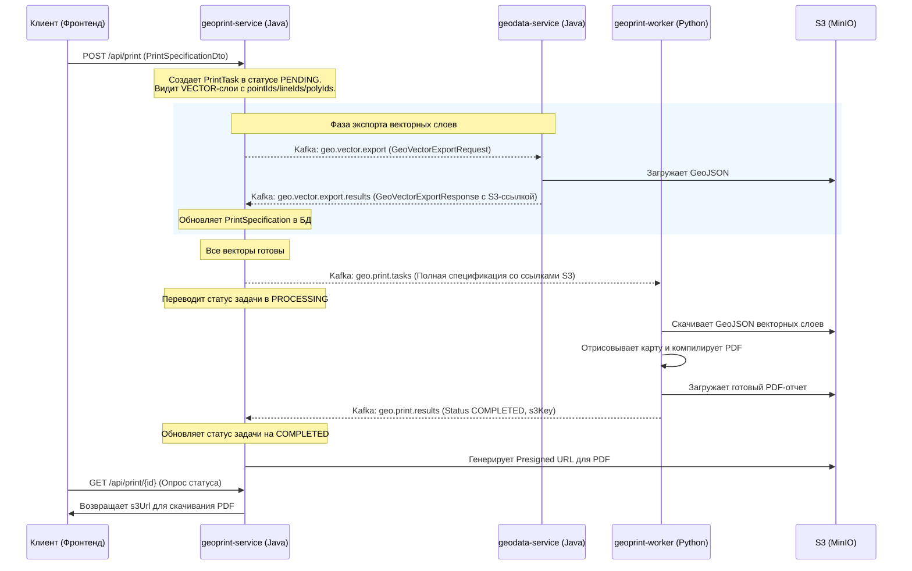

# GeoPrint Service (Java)

`geoprint-service` — это микросервис в составе архитектуры **ГеоИнфоСистема**, выполняющий роль REST API-интерфейса и центрального оркестратора задач печати. Он управляет жизненным циклом печатных отчетов, координирует выгрузку векторных слоев через Kafka и передает финальные задачи на обработку в Python-воркер `geoprint-worker`.

## 🚀 Основные возможности

*   **REST API для клиента:** Создание задач печати на основе спецификации `PrintSpecificationDto` и опрос статусов (`PrintTask`).
*   **Оркестрация экспорта векторных данных:** 
    *   При поступлении задачи с активными векторными слоями (`VECTOR`), требующими выгрузки, микросервис приостанавливает отправку задачи печати.
    *   Он отправляет асинхронные запросы `GeoVectorExportRequest` в Kafka-топик **`geo.vector.export`**, передавая списки идентификаторов объектов (`pointIds`, `multilineIds`, `polygonIds`), которые требуется экспортировать.
    *   Слушает топик **`geo.vector.export.results`** (в отдельной группе `geoprint-vector-results-group`), получая S3-ссылки на выгруженные GeoJSON-файлы.
    *   Обновляет метаданные слоев в БД и, только после успешной готовности всех векторных выгрузок, отправляет финальный пакет задачи в топик **`geo.print.tasks`** для Python-воркера.
*   **Генерация Presigned S3 URL:** После завершения печати воркером, микросервис генерирует временные безопасные ссылки для скачивания PDF из бакета S3.
*   **Управление статусами задач:** Хранение в PostgreSQL текущего состояния задач печати (`PENDING`, `PROCESSING`, `COMPLETED`, `FAILED`) с записью сообщений об ошибках в случае сбоев.

## 🛠 Технологический стек

*   **Java 16+**
*   **Spring Boot:** Базовый фреймворк приложения (Web, Data JPA).
*   **Spring Kafka:** Обмен сообщениями между сервисами.
*   **PostgreSQL & Liquibase:** Хранение истории и статусов задач печати, миграции схемы.
*   **MinIO SDK:** Интеграция с S3-совместимым объектным хранилищем для генерации presigned-ссылок.
*   **Lombok & MapStruct:** Ускорение разработки и маппинг DTO.

## 📂 Архитектурный Workflow оркестрации



## ⚙️ Сборка и запуск

Сборка микросервиса с помощью Maven:
```bash
./mvnw clean install -pl geoprint-service -am -DskipTests
```

Запуск сервиса:
```bash
./mvnw spring-boot:run -pl geoprint-service
```

### Настройки окружения (application.yml)
*   `spring.datasource.url` — URL к БД PostgreSQL (схема `print`).
*   `spring.kafka.bootstrap-servers` — адрес брокера Apache Kafka.
*   `minio.endpoint`, `minio.access-key`, `minio.secret-key` — параметры доступа к хранилищу S3.
